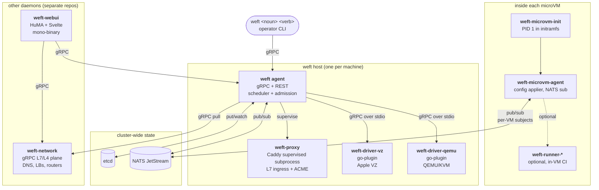

# weft — architecture overview

> Scope : the high-level mental map of weft. One paragraph of "what is this",
> the deployment shapes you can stand up, the daemons in play, the data
> + control flows between them, and where each topic is documented in
> depth. ~300 lines, all cross-references relative.

## Elevator pitch

**weft** is a multi-hypervisor microVM platform built around a single Go
binary (`weft`). The same binary boots the long-lived control-plane
daemon (`weft agent`), drives day-0 bring-up (`weft up cluster.hcl`),
runs the client RPCs (`weft <noun> <verb>`), and ships every host-side
tool. Hyperviser-specific code (Apple `Virtualization.framework`,
QEMU/KVM) lives behind a `go-plugin` interface so the core stays
CGO-free and arch-portable, with one driver-plugin process per
hypervisor on each host. State (catalogues, hosts, VMs, tenants,
plugins, federation) lives in etcd ; events flow on NATS ; the
runtime is microVM-first (`weft microvm …`) with classic VMs as an
escape hatch (`weft instance …`).

## Deployment shapes

| Shape | etcd | NATS | Driver plugins | Use case |
|---|---|---|---|---|
| **single-host dev** | embedded (`embed.Etcd` in-process) | embedded | 1 (vz on macOS, qemu on Linux) | laptop, CI, demo |
| **1-host prod** | embedded | embedded | N | small fleet, single failure domain |
| **3-DC HA** | external 3-node etcd quorum | external 3-node JetStream | N per host | production, see [ha-failover.md](../operations/ha-failover.md) |
| **federation-lite** | per-cluster, no shared state | per-cluster | N | 2-3 sites, recommendation-only placement (see [design/federation.md](./federation.md)) |
| **federation-full** | per-cluster | per-cluster | N | global tenant routing, optional `weft-federation` controller (future, design only) |

## Daemons and processes

The cast :

- **`weft agent`** — the single binary, the hot path of the cluster.
  Serves a gRPC API on a Unix socket (`~/.weft/weft.sock`) and over
  TCP/SSH for cross-host clients ; embeds etcd in single-host mode ;
  embeds the federation poller, plugin store, tenant-quota admission,
  RBAC + audit log. All other weft-* processes are subordinate to it.
- **`weft-proxy`** — a Caddy build supervised as a subprocess by
  `weft agent`. Shared cert storage on etcd ; reverse-proxy config
  derived from in-cluster service registrations + VM annotations. See
  [operations/proxy.md](../operations/proxy.md).
- **Driver plugins** — `weft-driver-vz` (Apple VZ, macOS, CGO +
  entitlement) and `weft-driver-qemu` (QEMU/KVM, Linux, pure-Go).
  Loaded over `go-plugin` (gRPC over stdio). The contract lives in
  `weft-driver-plugin`. Multiple drivers can coexist on one host ;
  scheduler honours the per-host capability list.
- **`weft-microvm-agent`** — runs inside each microVM. NATS-driven
  config applier (one `Subscriber` + `ApplyFunc` per concern : mesh
  WireGuard, mounts SFTP/FUSE, firewall nftables, …). Idempotent
  reconciliation against per-VM subjects.
- **`weft-microvm-init`** — PID 1 inside microVMs. Brings up the
  bare-minimum (FS mounts, ifup, agent launch) ; no systemd.
- **`weft-network`** — separate gRPC service for the L7/L4 plane (DNS
  zones + records, scheduling rules, load balancers, routers).
  16 RPCs, etcd-backed, runs as its own process.
- **`weft-webui`** — mono-binary HuMA backend + bundled Svelte SPA.
  Talks gRPC to `weft agent` and `weft-network`. OIDC + audit + rate
  limit baked in.
- **Runners** (`weft-runner-{github,gitlab,forgejo}`) — in-VM CI
  workers shipped as catalogue plugins. Provisioned through the same
  plugin install flow as any tenant workload.

## Control flow

**Day-0 bring-up** : `weft up cluster.hcl` (single-host or 3-DC) reads
the HCL, installs `weft` over SSH on each host, pushes
`/etc/weft/weft.hcl`, ships infra `plan.hcl`, fetches the microVM
kernel from an OCI artifact and pre-pulls the rootfs onto each host
before scheduling. The planner under `weft/cluster` is convergent and
1→3 extensible (start single, scale to HA without re-bootstrap).

**Steady-state — registry storage** : etcd holds every catalogue
(flavors, scripts, plugins, plugin instances, federation manifests),
every per-host fact (state, az/rack, cordon flag, GPU inventory, PCI
inventory, driver capabilities), every per-VM record (placement, ssh
keys, UEFI vars, custom properties, quota usage, requested
GPUs/PCIs). The agent embeds it (`embed.Etcd`) in single-host mode and
joins an external quorum in 3-DC mode.

**Steady-state — event bus** : NATS JetStream carries the dynamic
config fan-out to in-VM agents (mesh changes, mount changes, SG
rule changes), the OTel spans from `weft-network` publishers, and
the inter-daemon notifications that don't fit etcd watches.

**Pull model, not push** (per
[`openweft_pull_model`](../../../../README.md)) : cross-daemon
interactions are pull/reconcile, not synchronous push. `weft-agent`
is autosuffisant on its hot path ; `weft-network` reconciles via
etcd watch + NATS subscribe ; SchedulingRule compliance is streamed
on watch.

## Data plane

**VM lifecycle** : `CreateVM` lands on `weft agent`. Admission runs
tenant quotas (CPU / mem / vol / GPU / PCI — see
[operations/tenant-quotas.md](../operations/tenant-quotas.md)) and
RBAC ([operations/rbac.md](../operations/rbac.md)). The scheduler
picks a host honouring scheduling rules ([nominal binding](../../README.md)
gating selector), driver capability, GPU + PCI availability
([operations/gpu-scheduling.md](../operations/gpu-scheduling.md)),
and cordon state. `weft agent` on the picked host dispatches to the
local driver plugin ; for microVMs, the path goes through
`weft-microvm-agent` post-boot for config application.

**Volumes** : default backend is reflink-backed local copy-on-write
(btrfs / XFS / APFS `clonefile(2)`) for VM disks. Snapshots use the
same FICLONE/`clonefile` primitive. Off-host backup target is a
pluggable upload abstraction. For replicated block volumes the
project plan is `weft-block` (longhorn-engine fork-and-adapt, NBD
frontend, control plane in `weft/control/`). For replicated shares
the plan is CubeFS. Both are escape hatches for "I need replication
or backup beyond reflink".

**Mesh** : kernel-mode WireGuard, unified host↔guest topology.
Applied in-VM by `weft-microvm-agent` listening on a per-VM NATS
subject ; the host side is reconciled by `weft-network`.

## Catalogue and plugins

**Plugin manifest** : each plugin under `catalogue/<name>/plugin.hcl`
declares inputs (typed, optional defaults), VM blocks (count = HCL
expression over inputs), volume blocks, scheduling rules, and post-
provision scripts. Manifests are parsed by `pluginstore` and rendered
through `hclconfig`.

**Install flow** : `InstallPlugin(name, project, inputs)` (RPC) →
`pluginstore.Install` materialises VMs + volumes + rules in the
target project, deterministic instance UUID from
`hash(name, project, inputs)` so re-install with identical inputs
short-circuits.

**Federation place** (lite, design-stub in v0.1.0, implemented in
v0.2 per [design/federation.md](./federation.md)) : a SchedulingRule
can carry `federated=true` ; the federation poller pulls
`/cluster-info` from each declared peer, classifies them
`live | stale | unreachable`, and the placer returns recommendations
weighted by region + manifest weight. No remote write happens on the
hot path.

**Catalogue today** :

- HA platform : [postgres-ha](../catalogue/postgres-ha.md),
  [redis-ha](../catalogue/redis-ha.md),
  [minio-ha](../catalogue/minio-ha.md),
  [vault-ha](../catalogue/vault-ha.md),
  [caddy-edge](../catalogue/caddy-edge.md).
- HA observability : [grafana-ha](../catalogue/grafana-ha.md),
  [prometheus-ha](../catalogue/prometheus-ha.md),
  [loki-ha](../catalogue/loki-ha.md).
- CI runners : [github](../catalogue/github-runners-ha.md),
  [gitlab](../catalogue/gitlab-runners-ha.md),
  [forgejo](../catalogue/forgejo-runners-ha.md).
- Workloads : [jupyterhub-ha](../catalogue/jupyterhub-ha.md).
- Index : [catalogue README](../catalogue/README.md).

## Memory model — tenants, projects, quotas, RBAC

- **Projects** are today's tenant granularity. Every VM, volume,
  scheduling rule, plugin instance is project-scoped.
- **OIDC groups** map to scopes (read, write, admin) per project.
  SSO recipes for Keycloak / Okta / Auth0 are in
  [operations/sso/](../operations/sso/README.md).
- **RBAC + audit log** : every mutation is journaled (JSONL,
  append-only, rotated) ; the audit log is exposed via the webui
  admin panel + the REST `/api/audit/*` endpoints.
  See [operations/rbac.md](../operations/rbac.md).
- **Quotas** : per-project caps on `cpu_count`, `mem_gib`,
  `vol_gib`, `gpu_count`, `gpu_memory_gib`, `pci_count`. Enforced
  at admission, aggregated across all of the project's VMs.

## Supply chain

- **Release pipeline** : `task release` builds the binaries with
  `SOURCE_DATE_EPOCH` pinned, ships a tar + an OCI image, signs both
  with cosign keyless against the GitHub Actions OIDC issuer, and
  emits a Syft SBOM + SLSA L3 provenance attestation.
  See [operations/reproducible-builds.md](../operations/reproducible-builds.md).
- **Verification** : `cosign verify` against the workflow identity
  + `cosign verify-attestation` for the SLSA + SBOM predicates. The
  verifier flow is documented in
  [operations/cosign-verify.md](../operations/cosign-verify.md).
- **Disaster recovery** : cold-start runbook in
  [operations/disaster-recovery.md](../operations/disaster-recovery.md),
  etcd snapshot strategy in
  [operations/etcd-backup.md](../operations/etcd-backup.md),
  rolling-upgrade flow in
  [operations/upgrade.md](../operations/upgrade.md).
- **Validation** : the post-deploy
  [operations/validation-playbook.md](../operations/validation-playbook.md)
  ships 9 smoke scripts that work against a real cluster (auth,
  scheduling, volumes, mesh, quotas, GPU, PCI, federation, audit).

## Day-0 → day-2 references

- [getting-started/production-3host.md](../getting-started/production-3host.md)
  — walkthrough of a 3-DC bring-up, end-to-end.
- [operations/observability.md](../operations/observability.md) —
  Prometheus, OTel, Grafana dashboards.
- [operations/performance.md](../operations/performance.md) — tuning
  knobs and expected latencies.
- [operations/security-checklist.md](../operations/security-checklist.md)
  — production hardening list.

## What's NOT in this doc

- **Federation full** — design only (v0.3+ target) ; see
  [design/federation.md](./federation.md).
- **GPU exclusive pinning** — today scheduling is count-based
  (`gpu_count`) and MIG-slice aware ; per-tenant pinning of named
  PCI BDFs is future work.
- **Tenant-level RBAC** — today RBAC is project-scoped. A higher-
  level tenant boundary (group of projects with shared quota) is a
  follow-up doc.
- **Driver lifecycle / hot-swap** — drivers are pulled via OCI per
  [`project_driver_plugins`](../../../../README.md) but live driver
  upgrade requires VM drain ; runbook is in
  [operations/upgrade.md](../operations/upgrade.md) for now.
- **Block volume replication** — `weft-block` (Longhorn fork) is
  staged but not yet in the default install ; see
  [`project_weft_block`](../../../../README.md).

## TODO (follow-up docs)

- `operations/cordon.md` — currently the cordon flag + `weft host
  cordon`/`uncordon` flow lives only in the source + the changelog
  entry for `67fd017b1`. Needs its own runbook.
- `operations/pci-passthrough.md` — admission shape + vfio-pci
  binding + per-driver capability (qemu yes, vz no) deserve a
  dedicated page beyond what `gpu-scheduling.md` covers.
- `operations/backup.md` — off-host backup target abstraction
  (commit `a5a0d46f6`) + the snapshot-upload contract.
